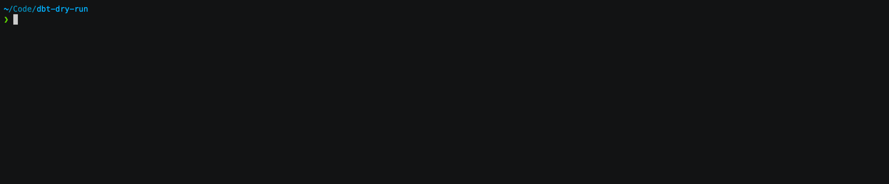

# dbt-dry-run

[dbt][dbt-home] is a tool that helps manage data transformations using templated SQL queries. These SQL queries are
executed against a target data warehouse. It doesn't check the validity of SQL queries before it executes your project.
This dry runner uses BigQuery's [dry run][bq-dry-run] capability to allow you to check that SQL queries are valid before
trying to execute them.

See the [blog post][blog-post] for more information on how the dry runner works.



## Quickstart

### Installation

The dry runner can be installed via pip:

`
pip install dbt-dry-run
`

### Running

The dry runner has a single command called `dbt-dry-run` in order for it to run you must first compile a dbt manifest
using `dbt compile` as you normally would.

Then on the same machine (So that the dry runner has access to your dbt project source and the
`manifest.yml`) you can run the dry-runner in the same directory as our `dbt_project.yml`:

```
dbt-dry-run
```

Like dbt it will search for `profiles.yml` in `~/.dbt/` and use the default target specified. Just like in the dbt CLI
you can override these defaults:

```
dbt-dry-run default --project-dir /my_org_dbt/ --profiles-dir /my_org_dbt/profiles/ --target local
```

The full CLI help is shown below, anything prefixed with [dbt] can be used in the same way as a normal dbt parameter:

```
  ❯ dbt-dry-run --help
    Usage: dbt-dry-run [OPTIONS] [PROFILE]
    
    Options:
      --profiles-dir TEXT             [dbt] Where to search for `profiles.yml`
                                      [default: /Users/<user>/.dbt]
      --project-dir TEXT              [dbt] Where to search for `dbt_project.yml`
                                      [default: /Users/<user>/Code/dbt-
                                      dry-run]
      --vars TEXT                     [dbt] CLI Variables to pass to dbt
      --target TEXT                   [dbt] Target profile
      --verbose / --no-verbose        Output verbose error messages  [default: no-
                                      verbose]
      --report-path TEXT              Json path to dump report to
      --install-completion [bash|zsh|fish|powershell|pwsh]
                                      Install completion for the specified shell.
      --show-completion [bash|zsh|fish|powershell|pwsh]
                                      Show completion for the specified shell, to
                                      copy it or customize the installation.
      --help                          Show this message and exit.
```

## Reporting Results & Failures

If the result is successful it will output the number of models that were tested like so:

```
Dry running 3 models

DRY RUN SUCCESS!
```

The process will also return exit code 0

If there are failures it will print a summary table of the nodes that failed:

```
Dry running 3 models
Node model.test_models_with_invalid_sql.second_layer failed with exception:
400 POST https://bigquery.googleapis.com/...: Column d in USING clause not found on left side of join at [6:88]

(job ID: 5e336f32-273d-480a-b8bb-cdf4fca66a98)

Total 1 failures:
1       :       model.test_models_with_invalid_sql.second_layer :       BadRequest      :       ERROR
DRY RUN FAILURE!`
```

The process will also return exit code 1

### Column and Metadata Linting (Experimental!)

The dry runner can also be configured to inspect your metadata YAML and assert that the predicted schema of your dbt
projects data warehouse matches what is documented in the metadata. To enable this for your models specify the key
`dry_run.check_columns: true`. The dry runner will then fail if the model's documentation does not match. For example
the full metadata for this model:

```yaml
models:
  - name: badly_documented_model
    description: This model is missing some columns in its docs
    meta:
      dry_run.check_columns: true
    columns:
      - name: a
        description: This is in the model

      - name: b
        description: This is in the model

      #      - name: c
      #        description: Forgot to document c

      - name: d
        description: This shouldn't be here
```

This model is badly documented as the predicted schema is 3 columns `a,b,c` the dry runner will therefore output the
following error and fail your CI/CD checks:

```text
Dry running X models
Node model.test_column_linting.badly_documented_model failed linting with rule violations:
        UNDOCUMENTED_COLUMNS : Column not documented in metadata: 'c'
        EXTRA_DOCUMENTED_COLUMNS : Extra column in metadata: 'd'

Total 1 failures:
1       :       model.test_column_linting.badly_documented_model        :       LINTING :       ERROR
DRY RUN FAILURE!
```

Currently, these rules can cause linting failures:

1. UNDOCUMENTED_COLUMNS: The predicted schema of the model will have extra columns that have not been documented in the
   YAML
2. EXTRA_DOCUMENTED_COLUMNS: The predicted schema of the model does not have this column that was specified in the
   metadata

This could be extended to verify that datatype has been set correctly as well or other linting rules such as naming
conventions based on datatype.

### Usage with dbt-external-tables

The dbt package [dbt-external-tables][dbt-external-tables] gives dbt support for staging and managing
[external tables][bq-external-tables]. These sources do not produce any compiled sql in the manifest, so it is not
possible for the dry runner to predict their schema. Therefore, you must specify the resulting schema manually in the
metadata of the source. For example if you were import data from a gcs bucket:

```yaml
version: 2

sources:
  - name: source_dataset
    tables:
      - name: event
        description: "Some events bucket. If external is populated then the dry runner will assume it is using `dbt-external-tables`"
        external:
          location: 'gs://bucket/path/*'
            format: csv

           dry_run_columns:
             - name: string_field
               data_type: STRING
               description: "Specify each column in the yaml for external sources"
             - name: record_array_field[]
               data_type: RECORD[]
               description: "For struct/record fields specify the `data_type` as `RECORD`"
             - name: record_array_field.foo
               data_type: NUMERIC
               description: "For record attributes use the dot notation"
             - name: integer_array
               data_type: NUMERIC[]
               description: "For repeated fields suffix data_type with []"
```

The dry runner cannot predict the schema, therefore, it is up to you to accurately describe the schema in the YAML otherwise 
you may get false positive/negative results from the dry run.

### Report Artefact

If you specify `---report-path` a JSON file will be outputted regardless of dry run success/failure with detailed
information of each node's predicted schema or error message if it has failed:

```json
{
  "success": false,
  "node_count": 3,
  "failure_count": 1,
  "failed_node_ids": [
    "model.test_models_with_invalid_sql.second_layer"
  ],
  "nodes": [
    {
      "unique_id": "seed.test_models_with_invalid_sql.my_seed",
      "success": true,
      "error_message": null,
      "table": {
        "fields": [
          ...
        ]
      }
    },
    {
      "unique_id": "model.test_models_with_invalid_sql.first_layer",
      "success": true,
      "error_message": null,
      "table": {
        "fields": [
          ...
        ]
      }
    },
    {
      "unique_id": "model.test_models_with_invalid_sql.second_layer",
      "success": false,
      "error_message": "BadRequest",
      "table": null
    }
  ]
}
```

## Contributing/Running locally

To setup a dev environment you need [poetry][get-poetry], first run `poetry install` to install all dependencies. Then
the `Makefile` contains all the commands needed to run the test suite and linting.

- verify: Formats code with `black`, type checks with `mypy` and then runs the unit tests with coverage.
- integration: Runs the integration tests against BigQuery (See Integration Tests)

There is also a shell script `./run-integration.sh <PROJECT_DIR>` which will run one of the integration tests locally.
Where `<PROJECT_DIR>` is one of the directory names in `/integration/projects/`. (See Integration Tests)

### Running Integration Tests

In order to run integration tests locally you will need access to a BigQuery project/instance in which your gcloud
application default credentials has the role `Big Query Data Owner`. The BigQuery instance should have an empty dataset
called `dry_run`.

Setting the environment variable `DBT_PROJECT=<YOUR GCP PROJECT HERE>` will tell the integration tests which GCP project
to run the test suite against. The test suite does not currently materialize any data into the project.

The integration tests will run on any push to `main` to ensure the package's core functionality is still in place.

__Auto Trader employees can request authorisation to access the `at-dry-run-integration-dev` project for this purpose__

## Capabilities and Limitations

### Things this can catch

The dry run can catch anything the BigQuery planner can identify before the query has run. Which includes:

1. Typos in SQL keywords:  `selec` instead of `select`
2. Typos in columns names: `orders.produts` instead of `orders.products`
3. Problems with incompatible data types: Trying to execute "4" + 4
4. Incompatible schema changes to models: Removing a column from a view that is referenced by a downstream model
   explicitly
5. Incompatible schema changes to sources: Third party modifies schema of source tables without your knowledge
6. Permission errors: The dry runner should run under the same service account your production job runs under. This
   allows you to catch problems with table/project permissions as dry run queries need table read permissions just like
   the real query
7. Incorrect configuration of snapshots: For example a typo in the `unique_key` config. Or `check_cols` which do not
   exist in the snapshot

### Things this can't catch

There are certain cases where a syntactically valid query can fail due to the data in the tables:

1. Queries that run but do not return intended/correct result. This is checked using [tests][dbt-tests]
2. `NULL` values in `ARRAY_AGG` (See [IGNORE_NULLS bullet point][bq-ignore-nulls])
3. Bad query performance that makes it too complex/expensive to run

### Things still to do...

Implementing the dry runner required re-implementing some areas of dbt. Mainly how the adapter sets up connections and
credentials with the BigQuery client, we have only implemented the methods of how we connect to our warehouse so if you
don't use OAUTH or service account JSON files then this won't be able to read `profiles.yml` correctly.

The implementation of seeds is incomplete as well as we don't use them very much in our own dbt projects. The dry runner
will just use the datatypes that `agate` infers from the CSV files.

[dbt-home]: https://www.getdbt.com/

[bq-dry-run]: https://cloud.google.com/bigquery/docs/dry-run-queries

[dbt-tests]: https://docs.getdbt.com/docs/building-a-dbt-project/tests

[bq-ignore-nulls]: https://cloud.google.com/bigquery/docs/reference/standard-sql/aggregate_functions#array_agg

[blog-post]: https://engineering.autotrader.co.uk/2022/04/06/dry-running-our-data-warehouse-using-bigquery-and-dbt.html

[get-poetry]: https://python-poetry.org/

[dbt-external-tables]: https://github.com/dbt-labs/dbt-external-tables

[bq-external-tables]: https://cloud.google.com/bigquery/docs/external-tables

## License

Copyright 2022 Auto Trader Limited

Licensed under the Apache License, Version 2.0 (the "License"); you may not use this file except in compliance with the
License. You may obtain a copy of the License at

http://www.apache.org/licenses/LICENSE-2.0

Unless required by applicable law or agreed to in writing, software distributed under the License is distributed on an "
AS IS" BASIS, WITHOUT WARRANTIES OR CONDITIONS OF ANY KIND, either express or implied. See the License for the specific
language governing permissions and limitations under the License.
